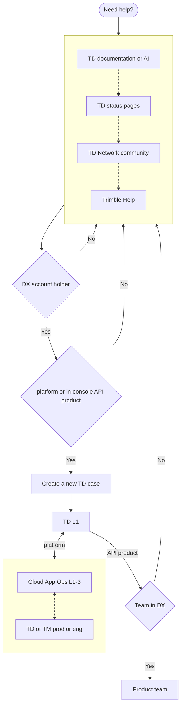

```mermaid
flowchart TD
	needhelp([Need help?])

	subgraph options[" "]
		direction TB
		documentation["TD documentation or AI"]
		pages["TD status pages"]
		community["TD Network community"]
		helpportal["Trimble Help"]
		documentation -.-> pages
		pages -.-> community
		community -.-> helpportal
	end

	dxholder{"DX account holder"}
	casetype{"platform or in-console API product"}
	createcase["Create a new TD case"]
	tdl1["TD L1"]
	teamindx{"Team in DX"}
	productteam["Product team"]

	subgraph platbranch[" "]
		direction TB
		cloudops["Cloud App Ops L1-3"]
		tdmpl["TD or TM prod or eng"]
		cloudops <-.-> tdmpl
	end

	needhelp --> options
	options --> dxholder
	dxholder -->|Yes| casetype
	dxholder -->|No| options
	casetype -->|Yes| createcase
	casetype -->|No| options
	createcase --> tdl1
	tdl1 <-->|platform| platbranch
	tdl1 -->|API product| teamindx
	teamindx -->|Yes| productteam
	teamindx -->|No| options
```
