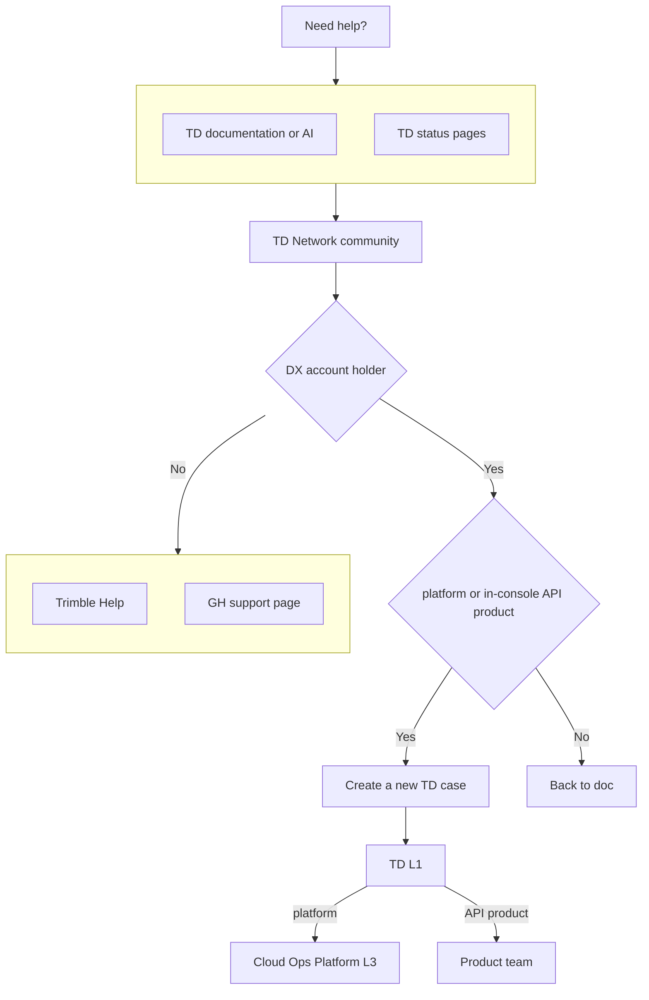

```mermaid
flowchart TD
	needhelp[Need help?]

	subgraph options[" "]
		direction TB
		documentation["TD documentation or AI"]
		pages["TD status pages"]
	end

	subgraph nondx[" "]
		direction TB
		helpportal["Trimble Help"]
		contact["GH support page"]
	end

	needhelp --> options

	community["TD Network community"]
	dxholder{"DX account holder"}

	options --> community
	community --> dxholder

	dxholder -->|Yes| casetype{"platform or in-console API product"}
	dxholder -->|No| nondx

	casetype -->|Yes| createcase["Create a new TD case"]
	casetype -->|No| dxback["Back to doc"]

	createcase --> tdl1["TD L1"]
	tdl1 -->|platform| cloudops["Cloud Ops Platform L3"]
	tdl1 -->|API product| productteam["Product team"]
```
